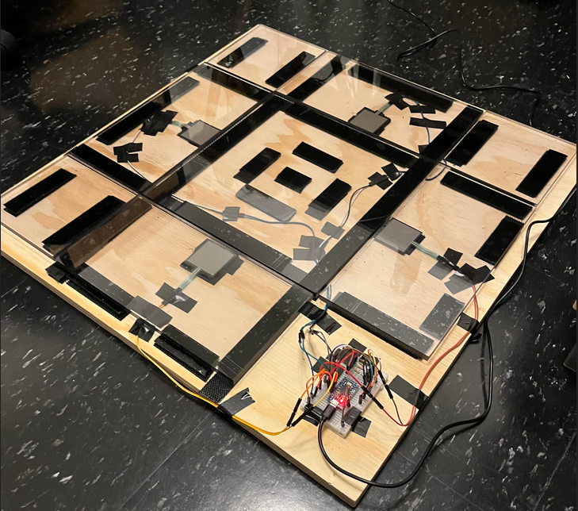

#  Why use pedals?
While they may not be the flashiest or most complex input method, I strongly believe that pedals are one of the best ways to control your computer with Talon. They provide intuitive  off or on states, while also allowing for variable length inputs when held down. This makes them ideal for tasks like scrolling that would otherwise be tedious with repetitive voice commands. Whether you're experiencing voice strain from excessive dictation or dealing with TMJ alongside a repetitive strain injury, a pedal can be an amazing device to improve productivity and give your voice more time to rest.

However, implementing pedals correctly can be deceptively difficult. From a hardware standpoint, many pedals are poorly designed and require excessive force to activate. It's not uncommon to hear stories of Talon users who purchase a pedal but end up overusing it and developing repetitive strain injury in their feet. On the software side, pedals can also be tricky. Operating systems generally don't handle processing multiple keys pressed simultaneously without special characters (e.g., shift, control). As a result, if we want to have multiple key presses at the same time, we need to utilize Talon's cron library to process a state dictionary in parallel, creating the illusion of simultaneous key presses.

I wanted to document my pedal setup here because most other setups I've seen don't allow for multiple key presses or special actions when a key is held down. By utilizing multiple key presses, we can transform a pedal with 3 switches into a device with six separate actions. Additionally, by incorporating special actions for specific length presses, we can add another three actions. Before long, we can quickly turn a simple input method into one with relatively complex features. Finally, when we introduce contextual overriding, the potential for actions becomes virtually infinite.

#  A Software Overview

 before I created a physically custom pedal I first created software that is generic over different hardware.  A talon file is used as a frontend by which the backend state dictionary is updated.  by binding each pedal as a hot key with a key that is rarely used like num lock,  we can capture input without needing a special joystick library.  Most nicer petals like the kinesis advantage or the Olympus foot switch can remap keys at the hardware level so we don't need any extra software.   Additionally by using normal keys,  once we progress two custom pedals, we don't need access to the Arduino joystick library and can use a wider variety of microcontrollers. 

 ```
 # An example key capture in the Talon script 
 # ( Specifically for the center pedal)

 # Center button (kpplus)
key(keypad_divide:down):    
   user.pedal_down('center')
key(keypad_divide:up):     
    user.pedal_up('center')
 ```

 After pressing down the key, an internal state dictionary is then updated.  If you wish to see the implementation, it can be found at [https://github.com/C-Loftus/my_talon_scripts/tree/master/pedal](https://github.com/C-Loftus/my_talon_scripts/tree/master/pedal) If you remap your pedal or foot switch to the proper keys as defined in the talon frontend you should be able to use my code right out of the box without any configuration.  If you look inside my `overrides` folder, you can see the variety of custom actions that are overridden contextually.  For instance, by default the left and right panels scroll up and down respectively, but if I am watching a YouTube video they control the volume.

#  Custom Hardware

 Growing up, I always enjoyed playing video games every once in a while, but after developing hand issues, I had pretty much given it all up. However, a few years ago I was looking into  Games that wouldn't require any hand usage and as a result, got into playing dance dance revolution. The game itself is pretty straightforward, but I was amazed at how well some people can play for such long periods of time and have such great dexterity in their feet. There's also a strong community of tankerers and those who build their own dance pads.  Using some of that inspiration, I was able to build my own custom pedal. That is really more like a dance pad.

 It is a relatively simple design, but in reality it is quite ergonomic and has an interesting design pattern compared to the unusual pedals.



 By using  sensitive resistors, we don't actually have to step on the panel, but can rather just simply switch our weight onto it. As a result, we have less of a risk for repetitive strain injury caused by a repeated extension of the ankles, like you would see in a. Car like pedal.

 


If you, your company or a colleague could benefit from personalized sessions for learning talon and optimizing a personal setup, please feel free to reach out to me.   I'd love to help you get your workflow to the next level.

